# codetree-badge

> Codetree progress badge generator for GitHub profile README — 코드트리 뱃지 · 코드트리 잔디 · 깃허브 프로필 꾸미기

코드트리(Codetree)의 학습 진도를 SVG 뱃지로 만들어 GitHub 프로필이나 저장소 README 에 붙일 수 있게 해주는 프로젝트입니다. 이 저장소를 fork 하고 본인의 코드트리 계정 정보를 Secrets 에 등록하면, GitHub Actions 가 매시간 진도를 가져와 `result/` 아래의 SVG 를 갱신합니다. 별도의 서버 없이 fork 하나가 곧 나만의 뱃지 인스턴스가 됩니다.

<p align="center">
  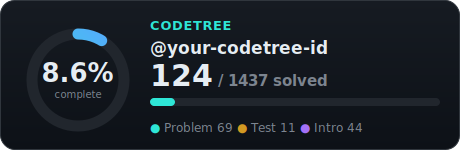
</p>
<p align="center">
  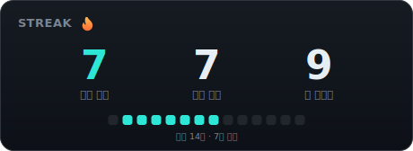
</p>

## 동작 방식

코드트리는 solved.ac 와 달리 공개 프로필 API 가 없어서, 진도를 읽으려면 본인 계정으로 로그인해야 합니다. 그래서 중앙 서버가 여러 사용자의 계정을 대신 다루는 구조 대신, 각자의 fork 안에서 GitHub Actions 가 본인 Secrets 로 로그인하는 구조를 택했습니다. 계정 정보는 fork 밖으로 나가지 않습니다.

워크플로는 매시 정각에 실행되어 진도·스트릭·프로필을 가져오고, SVG 를 렌더링해 `result/` 에 커밋합니다. 같은 갱신 커밋은 amend 로 합쳐져 히스토리가 늘어나지 않으며, 커밋 주체가 `github-actions[bot]` 이므로 잔디(contribution graph)에도 남지 않습니다.

## 설정 방법

### 1. Fork

이 저장소 우측 상단의 **Fork** 버튼을 눌러 본인 계정으로 복사합니다.

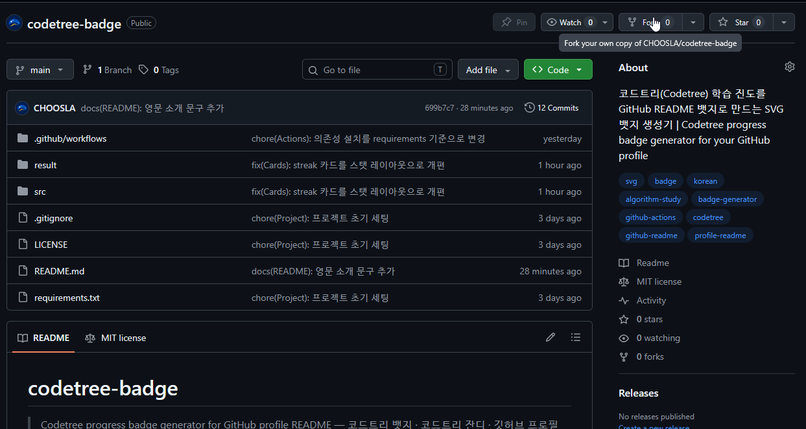

### 2. Secrets 등록

fork 한 저장소에서 **Settings → Secrets and variables → Actions → New repository secret** 으로 이동해 아래 두 가지를 등록합니다.

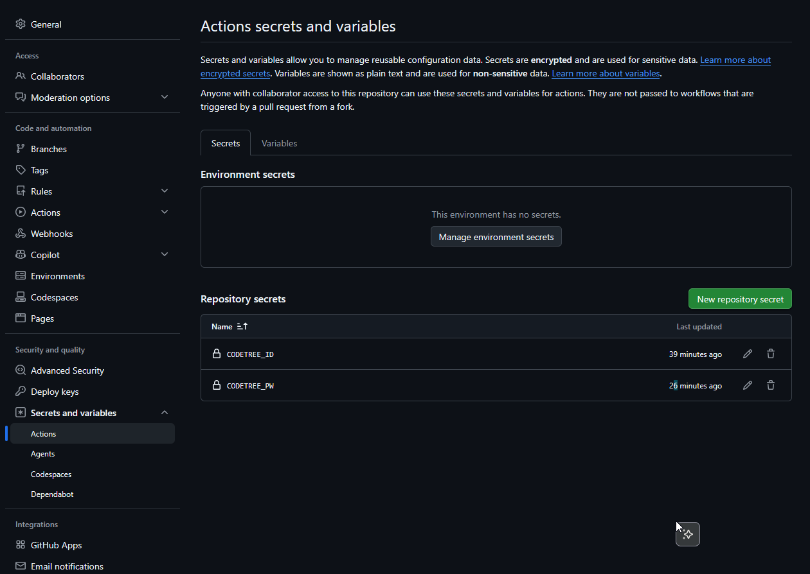

| Secret | 값 |
| --- | --- |
| `CODETREE_ID` | 코드트리 로그인 아이디(이메일) |
| `CODETREE_PW` | 코드트리 비밀번호 |

계정 정보는 fork 한 본인 저장소의 Secrets 에만 저장되며 코드나 커밋에 노출되지 않습니다.

### 3. Actions 활성화

fork 된 저장소는 예약 실행(schedule)이 기본 비활성 상태입니다. **Actions 탭**에서 "I understand my workflows, go ahead and enable them" 을 눌러 활성화합니다.

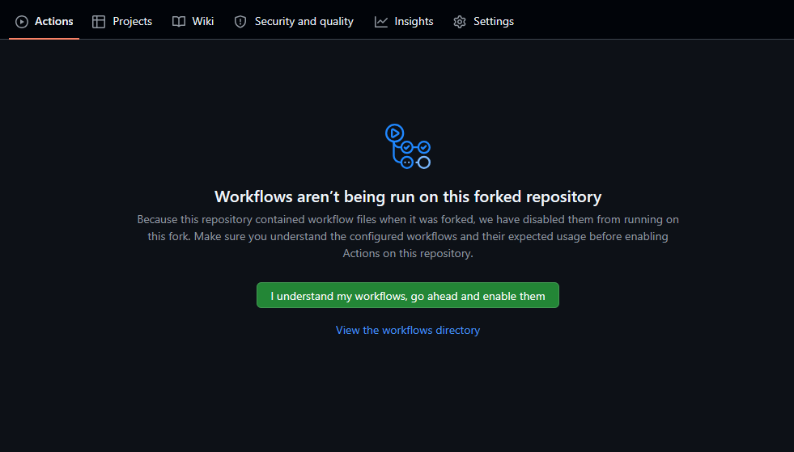

### 4. 첫 실행

**Actions → 뱃지 갱신 → Run workflow** 버튼으로 한 번 수동 실행합니다. 성공하면 `result/` 의 SVG 들이 본인 데이터로 바뀝니다.

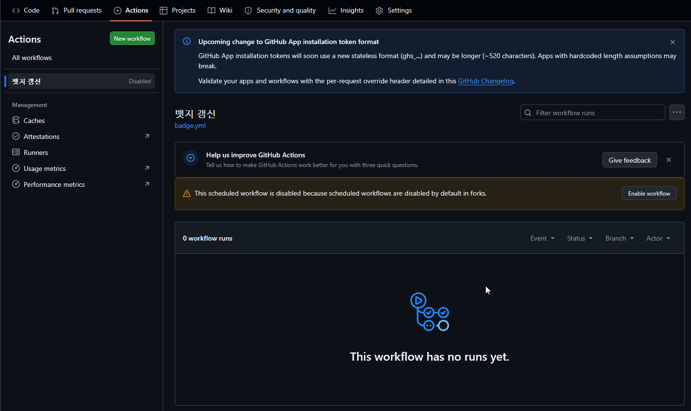

## README 에 붙이기

### 이미지 주소 만들기

카드 한 장의 주소는 아래 형태입니다. `{username}` 만 본인 GitHub 아이디로 바꾸면 됩니다.

```
https://raw.githubusercontent.com/{username}/codetree-badge/main/result/summary.svg
```

- `{username}` — fork 한 본인의 GitHub 아이디 (원본 저장소 주인이 아니라 **본인** 아이디)
- `main` — fork 의 기본 브랜치 이름. 다르면 그에 맞게 바꿉니다.
- `summary.svg` — 아래 카드 목록에서 원하는 파일명

주소가 맞는지 확인하려면 브라우저에 그대로 붙여넣어 보세요. 카드 SVG 가 열리면 성공입니다.

### 전체 카드 갤러리

아래는 샘플 데이터로 렌더링한 12종 카드 전체입니다. fork 후 워크플로가 한 번 성공하면 본인 데이터로 바뀌고, 이후에는 매시간 자동으로 갱신됩니다.

#### `summary.svg` — 학습 현황 요약

<p align="center"></p>

프로필 맨 위에 두기 좋은 대표 카드입니다. 왼쪽 링은 코드트리 전체 커리큘럼 대비 완료율이고, 오른쪽에는 계정 이름과 함께 푼 문제 수(`124 / 1437 solved`)가 큰 숫자로 표시됩니다. 그 아래 가로 바는 같은 완료율을 한 번 더 시각화한 전체 진척 바이며, 맨 아래 줄은 푼 문제를 Problem(실전 문제) · Test(테스트) · Intro(개념 학습) 유형별로 나눈 개수입니다.

#### `streak.svg` — 연속 학습 현황

<p align="center"></p>

꾸준함을 보여주는 카드입니다. 왼쪽부터 **현재 연속**(오늘까지 며칠 연속으로 학습했는지), **최고 연속**(지금까지 가장 길었던 연속 기록), **총 학습일**(학습한 날의 총합) 세 숫자가 나란히 놓입니다. 하단의 점 줄은 최근 14일이 한 칸씩이며, 학습한 날만 청록색으로 켜집니다. 연속이 끊겨도 과거 기록은 그대로 남습니다.

최고 연속과 총 학습일은 실행할 때마다 학습일을 `data/days.json` 에 누적해 계산합니다. 코드트리 API 가 최근 열흘치만 주기 때문에, 처음에는 최근 기록부터 시작해 시간이 지날수록 정확해집니다.

#### `xp.svg` — 일별 획득 XP

<p align="center">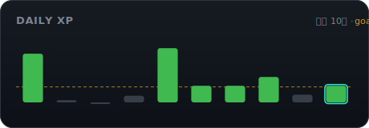</p>

최근 열흘간 하루하루 얼마나 학습했는지를 막대로 보여줍니다. 주황 점선이 코드트리에서 설정한 일일 목표 XP 이고, 목표를 넘긴 날은 초록 막대, 못 넘긴 날은 회색 막대로 구분됩니다. 오늘(가장 오른쪽)은 청록 테두리로 강조되어 지금 목표까지 얼마나 남았는지 한눈에 보입니다.

#### `types.svg` — 유형별 진행률

<p align="center">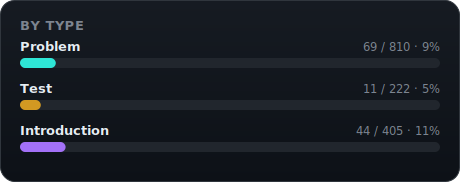</p>

커리큘럼을 문제 유형으로 쪼개 본 카드입니다. Problem(실전 문제 풀이) · Test(단원 테스트) · Introduction(개념 학습) 각각에 대해 `푼 수 / 전체 수 · 퍼센트` 와 진행률 바를 보여줍니다. 어떤 유형에 학습이 치우쳐 있는지 확인할 때 유용합니다.

#### `ladder.svg` — 트레일 전체 사다리

<p align="center">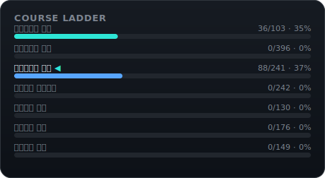</p>

코드트리 트레일 7개 코스를 위(입문)부터 아래(실전)까지 사다리처럼 쌓아 보여줍니다. 코스마다 진행률 바와 `푼 수 / 전체 수 · 퍼센트` 가 붙고, 지금 진행 중인 코스는 굵은 글씨와 ◀ 화살표로 표시됩니다. 전체 커리큘럼에서 내가 어디쯤 와 있는지 보여주는 로드맵 카드입니다.

#### `course_0.svg` ~ `course_6.svg` — 트레일 단계별 미니 카드

<p align="center">
  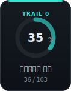
  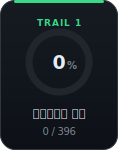
  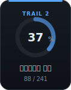
  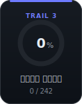
</p>
<p align="center">
  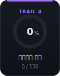
  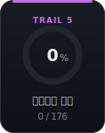
  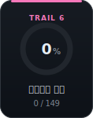
</p>

트레일 한 코스가 카드 한 장인 폭 118px 미니 카드입니다. 상단 색 띠와 `TRAIL n` 라벨로 단계를 구분하고, 가운데 링과 퍼센트가 해당 코스의 진행률, 하단이 코스 이름과 `푼 수 / 전체 수` 입니다. 색은 쉬운 단계(청록)에서 어려운 단계(핑크)로 흐르는 램프라서 나란히 붙이면 하나의 그라데이션처럼 보입니다. 7장을 다 붙여도 되고, 진행 중인 단계 몇 장만 골라 붙여도 됩니다.

### 기본: 마크다운 한 줄

프로필 README(`{username}/{username}` 저장소의 `README.md`)나 아무 저장소 README 에 아래처럼 넣습니다.

```markdown

```

### 클릭하면 코드트리로 이동하게

이미지 문법을 링크 문법으로 감싸면 카드를 눌렀을 때 코드트리로 이동합니다.

```markdown
[](https://www.codetree.ai/)
```

### 가운데 정렬·여러 장 배치 (HTML)

마크다운 이미지 문법은 정렬을 지정할 수 없어서, 배치를 다듬고 싶다면 HTML `` 를 씁니다. GitHub README 는 `<p>`, `<div>`, ``, `align`, `width` 정도의 HTML 을 허용합니다.

한 장을 가운데에:

```html
<p align="center">
  
</p>
```

두 장을 한 줄에 나란히 (같은 `<p>` 안에 이어 쓰면 옆으로 붙습니다):

```html
<p align="center">
  
  
</p>
```

트레일 미니 카드 7장을 한 줄에:

```html
<p align="center">
  
  
  
  
  
  
  
</p>
```

크기를 줄이고 싶으면 `width` 속성을 씁니다. SVG 라서 확대·축소해도 깨지지 않습니다.

```html

```

### 조합 예시: 프로필 대시보드

위 조각들을 합친 완성 예시입니다. 그대로 복사한 뒤 `{username}` 만 바꾸면 됩니다.

```html
<p align="center">
  
</p>
<p align="center">
  
  
</p>
<p align="center">
  
</p>
```

### 자주 겪는 문제

- **이미지가 안 뜸** — 주소를 브라우저에서 직접 열어보세요. 404 라면 아이디·브랜치·파일명 중 하나가 틀렸거나, fork 에서 워크플로가 아직 한 번도 성공하지 않아 `result/` 가 샘플 상태인 경우입니다.
- **fork 가 private 임** — `raw.githubusercontent.com` 은 public 저장소만 익명으로 열 수 있습니다. 뱃지 저장소는 public 으로 두어야 합니다(계정 정보는 Secrets 에 있으므로 노출되지 않습니다).
- **갱신했는데 그대로임** — GitHub 는 README 이미지를 프록시(camo)로 캐시합니다. 몇 분 기다리거나, 브라우저 캐시를 무시하고 새로고침(Ctrl+Shift+R)해 보세요.

## 즉시 갱신 (선택)

매시간 갱신 외에, 문제를 푼 직후 바로 반영하고 싶다면 풀이 저장소의 워크플로에서 `repository_dispatch` 를 쏘면 됩니다. `repo, workflow` 권한이 있는 PAT 이 필요합니다.

```yaml
- name: 뱃지 즉시 갱신
  run: |
    curl -fsS -X POST \
      -H "Authorization: Bearer ${{ secrets.BADGE_PAT }}" \
      -H "Accept: application/vnd.github+json" \
      https://api.github.com/repos/{username}/codetree-badge/dispatches \
      -d '{"event_type":"refresh-badge"}'
```

## 업데이트 받기 (Sync fork)

이 저장소에 카드 디자인이나 기능 개선이 올라오면, fork 페이지 상단의 **Sync fork → Update branch** 버튼 한 번으로 받아올 수 있습니다.

충돌 걱정은 하지 않아도 됩니다. 원본 저장소는 `src/`, `docs/`, 워크플로만 수정하고, fork 의 봇은 `result/` 와 `data/` 만 수정하도록 경로를 분리해 두었기 때문에 두 변경이 겹치지 않습니다. 동기화해도 본인의 뱃지 데이터(`result/`, `data/days.json`)는 그대로 유지됩니다.

## 로컬 미리보기

자격증명 없이 샘플 데이터로 카드를 렌더링해 볼 수 있습니다.

```bash
python src/generate.py --sample
```

## 알아둘 점

- GitHub 는 저장소에 60일간 활동이 없으면 예약 워크플로를 자동으로 비활성화합니다. 뱃지 갱신 커밋 자체가 활동으로 잡히므로 평소에는 문제가 없지만, 오래 쉬었다가 돌아오면 Actions 탭에서 다시 활성화해야 할 수 있습니다.
- README 의 이미지는 GitHub 의 이미지 프록시(camo)를 거치므로, 갱신 후 실제 반영까지 캐시 시간만큼 지연될 수 있습니다.

## 면책 (Disclaimer)

개인용 도구이며, 본인 계정으로 본인의 학습 데이터만 가져옵니다. Codetree 및 Branch & Bound 와 무관한 비공식 프로젝트입니다. 가져오는 정보는 진도 메타데이터(푼 문제 수, 연속 학습일, 트레일 진행도 등)에 한정되며, 문제나 풀이 같은 저작 콘텐츠는 포함하지 않습니다. 자동화된 접근은 해당 서비스의 이용약관에 어긋날 수 있으므로, 사용에 따르는 책임은 사용자 본인에게 있습니다.

## License

MIT
